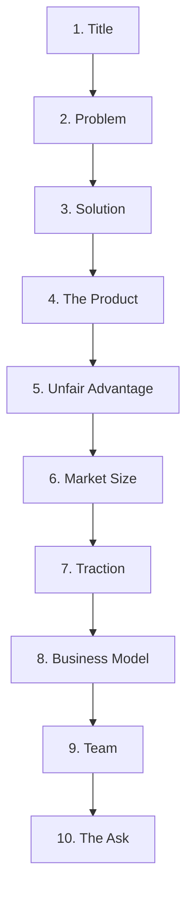

# Product Lens Audit: Smriti — The Company Brain

This document presents a structured product audit of **Smriti** using the **Product Lens** framework, followed by a strategic 10-slide VC startup pitch deck structure.

---

## Part 1: Product Diagnosis

### 1. Core User Value Proposition
**Smriti** is the **"Company Brain"** for engineering teams—a private, on-premise, local-first AI knowledge assistant that indexes unstructured communications (Slack, emails), documents (Google Drive, Confluence, PDFs), and live meetings (via the **Sutra** Playwright bot).

* **Onboarding Optimization:** Bypasses manual knowledge search and reduces onboarding friction for new hires by providing instant, cited, grounded answers to architectural and process questions.
* **Brain Drain Mitigation:** Captures and index years of architectural decisions, incident postmortems, and tribal knowledge that would otherwise exit the organization with departing team members.
* **CISO-Grade Privacy Guarantee:** Runs 100% offline via local models (`phi4-mini` and `nomic-embed-text` on Ollama) on the company's own secure infrastructure. It eliminates the blocker of data egress to third-party APIs (OpenAI/Anthropic/Gemini) for highly sensitive proprietary code bases and communications.

---

### 2. Primary Unfair Technical Advantage (The Moat)
Smriti's moat is not the general LLM capabilities (which are commodity), but the highly custom **substrate layers** and **crawler orchestration**:

| Moat Component | Technical Implementation | Why It is Hard to Copy |
| :--- | :--- | :--- |
| **Grounding Firewall** | Sentence-level lexical N-gram overlap checking + 4-digit date/year anchor verification in [grounding.py](file:///Users/gowtham/smriti/backend/grounding.py). | Eliminates hallucinations of small localized models (like 3.8B parameter `phi4-mini`) without the CPU-choking latency of secondary verification LLM calls. |
| **Expert Routing Network** | real-time organizational graph indexing in [graph_analytics.py](file:///Users/gowtham/smriti/backend/graph_analytics.py). It tracks person-to-person interactions (Slack threads, replies) with exponential time-decay and automatic edge pruning. | Synthesizes a live model of "who knows what" directly from Slack metadata, solving search when written docs are outdated or missing. |
| **Sutra Meeting Crawler & Reconciler** | Playwright meeting crawler ([sutra_bot.js](file:///Users/gowtham/smriti/backend/sutra_bot.js)) that crawls live closed captions, combined with semantic conflict resolution ([sutra_reconciler.py](file:///Users/gowtham/smriti/backend/sutra_reconciler.py)). | Automatically joins meetings, extracts structured decision nodes, runs pgvector queries to find past decisions, and flags contradictions, dependencies, or superseding changes. |
| **Quantized Local-first RAG Pipeline** | RRF (Reciprocal Rank Fusion) hybrid search combining HNSW vectors with BM25 keyword matching, reranked by an ONNX-quantized cross-encoder (`ms-marco-MiniLM-L6-v2`) on CPU. | Achieves a 77%+ Recall@10 and 92.4% retrieval hit rate on Microsoft's *EnterpriseRAG-Bench* while staying within the constraint of 8GB–12GB RAM hardware. |

---

### 3. Product-Market Fit (PMF) Signals & Score
**PMF Score: 6.5 / 10**

* **Strengths:** High technology readiness, 100% offline capability, working Google Drive/Slack/Confluence connectors, and a live deployment at `smriti.one`. Disabling asyncpg statement caching makes it compatible with production pgvector transaction pooling (PgBouncer).
* **Gaps:** The "Expert Routing" UI is currently a backend-only engine (cold-start handling is present, but UI has not been populated with expert recommendations). Lacks live usage analytics `/admin/stats` dashboard to measure query frequency and retention.
* **Traction Wedge:** In the middle of an outreach sprint to secure the first paying design partners at $100/month.

---

### 4. Moat-Expansion & Moat-Building Opportunities
* **Expert Routing UI:** Expose the backend `graph_analytics.py` expertise scores directly to the user during queries (e.g., *"Here is the answer. If you have follow-up questions, Gokul and Fabio are the top experts on this module."*).
* **Structured Semantic Graph:** Instead of standard RAG text-chunks, construct a durable knowledge graph of rules, versioning, and contradictions.
* **MCP (Model Context Protocol) Server Integration:** Compile the versioned semantic rules directly into machine-readable tool schemas, letting autonomous developer agents consume the "Company Brain" to safely execute edits.

---

## Part 2: 10-Slide VC Startup Pitch Deck Structure

This deck is optimized to pitch Smriti's seed round ($1.5M - $2M) to early-stage VCs, targeting the **Company Brain** Request for Startups (RFS) thesis.

---

### Slide 1: Title & Vision
* **Title:** Smriti: The Company Brain
* **Subtitle:** Your organization's institutional knowledge, permanently queryable and 100% private.
* **Visual:** Premium, minimal dark-mode landing interface of Smriti, showcasing a query returning a fully cited, grounded answer alongside a list of identified organizational experts.

### Slide 2: The Problem
* **The Tribal Knowledge Leak:** 80% of enterprise knowledge lives in transient Slack threads, meeting transcripts, and the heads of senior engineers.
* **The Onboarding Tax:** New engineers spend their first 3–4 weeks repeating solved questions, dragging senior engineers away from shipping code.
* **The Security Firewall:** Enterprises and highly regulated sectors (Finance, Health, Defense) strictly block sending proprietary documents or codebase patterns to cloud LLM APIs (OpenAI/Anthropic/Gemini) due to compliance regulations.

### Slide 3: The Solution
* **A Local-First Company Brain:** A tenant-isolated, local-first RAG knowledge assistant running fully on the customer's secure internal infrastructure.
* **Multi-Connector Ingestion:** Real-time, automatic sync with Slack, Google Drive, and Confluence.
* **Sutra Meeting Assistant:** Playwright meeting bot that captures transcript captions, extracts decision nodes, and reconciles changes against the company's historical decisions.

### Slide 4: The Product & Demo
* **Interactive Walkthrough (60-sec screen recording):**
  1. *Step 1:* User authenticates with Google Workspace and Slack.
  2. *Step 2:* Ingests a project folder (files, postmortems, chats).
  3. *Step 3:* User queries: *"Why did we move away from prepared statements in our database connector?"*
  4. *Step 4:* Instant, cited answer explaining PgBouncer transaction pooling limitations, linking to source code + Slack conversations.
  5. *Step 5:* Surfaces the top 3 team members who configured it (Expert Routing).

### Slide 5: The Unfair Advantage (Moats)
* **The Grounding Firewall:** Custom sentence-level lexical validation engine that screens out LLM hallucinations before they reach the user, enabling high-fidelity responses from small, efficient models.
* **Decision Reconciler (Sutra):** A semantic resolution engine that detects if a new meeting decision contradicts or supersedes past decisions, preventing architectural drift and regressions.
* **Dynamic Expertise Network:** Real-time graph analytics that maps organizational communication patterns to determine who actually owns specific domains.

### Slide 6: Market Size (TAM)
* **TAM (Total Addressable Market):** $15B+ Enterprise Search & Knowledge Management.
* **SOM (Serviceable Obtainable Market):** $2.1B initial focus on security-sensitive industries (Defense, Biotech, Fintech, Healthtech) with strict compliance needs preventing cloud-hosted AI integrations.
* **The Trend:** The shift from public cloud APIs to local/hybrid private AI deployments (LLM cost drop, hardware capacity growth).

### Slide 7: Traction & Proof
* **Metrics & Benchmarks:**
  * **92.4% Retrieval Hit Rate** on Microsoft's *EnterpriseRAG-Bench*.
  * **116ms p50 Latency** via localized HNSW + BM25 Reciprocal Rank Fusion (RRF).
  * **Live Demo:** Fully functional at `smriti.one`.
  * **Traction Wedge:** Secure first paying design partner at $100/month (moving toward enterprise pilot trials).

### Slide 8: Business Model & Go-To-Market
* **Pricing Tiers:**
  * *Team Starter:* $15 / user / month (Cloud-hosted private instance).
  * *Enterprise Self-Hosted:* $150–$500 / team / month (Deploys locally on internal Kubernetes or VMs via Docker/Ollama).
* **Distribution Strategy:**
  * Developer-first organic acquisition (Show HN, open-source repository).
  * Warm outreach to Engineering Managers and CTOs at security-sensitive startups.

### Slide 9: Team
* **Gowtham Pentela (Founder):**
  * AI/ML Engineer with 6+ years of experience building production LLM systems.
  * Specialized in evaluation harnesses, safety/alignment mechanisms, and data-secure architectures.

### Slide 10: The Ask & Milestones
* **The Ask:** Raising a $500k Pre-Seed / $1.5M Seed round.
* **Milestones (Next 12 Months):**
  * Expand native connectors to include email (IMAP/Gmail), JIRA, and GitHub.
  * Secure 10 enterprise design partners.
  * Integrate Model Context Protocol (MCP) server so developer agents can leverage the Company Brain to perform edits.
  * Hire 2 senior AI/Backend engineers.
