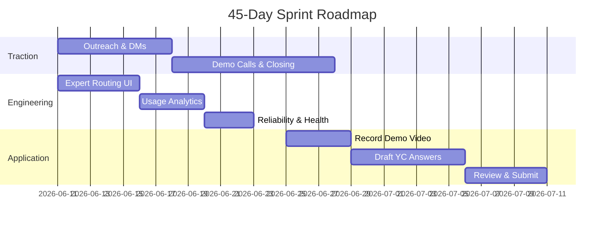

# Smriti: YC Application & Pitch Script
> **Project URL:** [smriti.one](https://smriti.one)  
> **Target Accelerator:** Y Combinator Summer 2026 (W27 Application)  
> **Timeline Context:** Day 15 of 45-day Sprint  

---

## 1. The Vision: Tom Blomfield’s "Company Brain"

In YC’s **Request for Startups**, partner Tom Blomfield (co-founder of Monzo) outlined the need for the **"Company Brain"**. Most enterprise AI deployments fail not because LLMs lack general capability, but because they lack a reliable, structured knowledge substrate.

### The Thesis
* **The Failure of Chat:** Chatbots are point solutions. They answer questions for humans, but they don't solve the underlying problem: structuring tribal memory so that autonomous agents can act on it.
* **Vector Embeddings are Not Enough:** Semantic search (`pgvector`/RAG) only finds similar text chunks. It does not understand contradictions, dependencies, or versioning. When two documents conflict, RAG fails.
* **The Platform Solution:** A true "Company Brain" compiles unstructured communications (Slack, emails, tickets) into a **versioned, structured, and auditable semantic graph of rules**. This graph compiles directly into machine-readable tool schemas (such as MCP configurations) that autonomous agents can invoke.

---

## 2. The Problem We Are Solving

1. **Tribal Memory Loss:** Crucial operational context (e.g., "how we handle incident X", "why we chose architecture Y") is buried in Slack threads and postmortems.
2. **High Onboarding Overhead:** New engineers spend weeks asking repeat questions, pulling senior engineers away from product development.
3. **Knowledge Depreciation:** When team members leave, their specific process knowledge leaves with them, creating critical single points of failure.
4. **The CISO Blocker:** Enterprise security policies strictly prohibit sending proprietary communications or customer data to third-party model APIs (OpenAI/Anthropic).

---

## 3. What We Have Built (Current State)

We have built a working, secure, local-first RAG and knowledge retrieval system live at [smriti.one](https://smriti.one):

### A. Ingestion & Connectors
* **Slack Connector:** Real-time channel history pull, Fernet-encrypted token storage, and deduplication.
* **Google Drive Connector:** Auth PKCE callback flow to list, fetch, and index Docs, Sheets, Slides, and PDFs.
* **Confluence Connector:** OAuth-enabled space and page indexing.
* **OCR Support:** Image extraction and page-by-page OCR rendering for scanned PDFs using a hybrid PyMuPDF/Tesseract pipeline.
* **Sync Scheduler:** Async background runner ([sync_scheduler.py](file:///Users/gowtham/local-assistant/backend/sync_scheduler.py)) syncing connected channels every 30 minutes.

### B. Retrieval & Performance
* **Hybrid Search:** Cosine similarity via pgvector (70%) combined with PostgreSQL full-text search (30%).
* **Latency Optimization:** Two-phase HNSW retrieval, delivering a **p50 latency of 116ms** (12.3× improvement over standard scans).
* **High Accuracy:** Validated against Microsoft’s *EnterpriseRAG-Bench*, achieving a **92.4% retrieval hit rate**.

### C. Local Generation & Privacy Architecture
* **100% Offline Inference:** Model execution (`phi4-mini:latest` Q4_K_M) and embedding generation (`nomic-embed-text`) run fully locally via Ollama. No data leaves the server.
* **Grounding Firewall:** Sentence-level word-overlap checks to strip hallucinations before returning responses.
* **Tenant Isolation:** Multi-tenant data segregation partitioning vector chunks by a unique `tenant_id` UUID namespace.

### D. Answer Quality & Fallback Handling (Just Completed)
* **Query Classification:** Dynamic query classifier detecting *Factual* vs. *Exploratory* questions to tune temperature (0.0 vs 0.3) and prompt templates.
* **Similarity Thresholding:** Out-of-scope queries with a similarity score `< 0.51` immediately trigger fallback.
* **Admin-Aware Fallback:** Hallucinated or low-confidence queries default to a clean response: `"I don't have that information from the indexed documents, please contact <admin_email>"`, pulling the active workspace admin's email dynamically.
* **Normalization:** Robust sanitization of curly quotes (`’` to `'`) to ensure grounding patterns match.

---

## 4. What Is Remaining (The Startup Application Gaps)

To turn Smriti from a high-quality technical prototype into an investable startup application, we must solve the following:

### 1. Traction Wedge (The #1 Priority)
* **Goal:** At least 1 paying customer (or a signed letter of intent for a design partnership at $50–$200/month).
* **Why:** YC evaluates traction above all else. A live demo with paying users proves demand.

### 2. Product-to-Brain Transition (Surfacing the Social Graph)
* **Goal:** Implement the "Expert Routing" UI.
* **Why:** The backend analytics code ([graph_analytics.py]) already identifies who knows what. Surfacing "Ask the Expert" (showing the top 3 team members who have written about a topic) directly in the UI moves Smriti from a search tool to a team intelligence dashboard.

### 3. Demo Video (60 Seconds)
* **Goal:** A concise screen-record explaining:
  1. *The Hook (15s):* Onboarding friction and lost tribal knowledge.
  2. *The Demo (35s):* Indexing a Google Drive folder -> asking a question -> getting cited, offline-grounded answers.
  3. *The Close (10s):* Enterprise privacy guarantee.
* **Why:** YC partners watch the video first. It must be polished and under 60 seconds.

### 4. Metrics Logging & Analytics
* **Goal:** Simple `/admin/stats` dashboard tracking query counts, token usage, and indexed document volume per tenant.
* **Why:** Shows investors actual usage metrics and growth.

---

## 5. Timeline & Milestones (Days 15–45)

### 📅 Phase 1 (Days 15–22): Traction & Expert Routing
* **Traction:** Follow up on first-wave outreach. Book 2 demo calls. 
* **Engineering:** Create the "Expert Routing" UI. When a query is answered, display the team members with the highest semantic overlap on the topic.
* **Deliverable:** UI displays experts. 1 demo call completed.

### 📅 Phase 2 (Days 23–30): Close First Customer & Analytics
* **Traction:** Pitch the "Design Partner" tier ($100/mo) on demo calls. Close 1 paying customer.
* **Engineering:** Implement the `/admin/stats` usage logging and health monitoring.
* **Deliverable:** First signed credit card on file. Analytics logs active in database.

### 📅 Phase 3 (Days 31–38): YC Demo Video & Draft
* **Traction:** Collect feedback from the active design partner.
* **Engineering:** Conduct a clean demo walk-through on M2 hardware and record the 60-second Loom video.
* **Application:** Draft YC written responses (utilizing the curated responses in Section 6).
* **Deliverable:** 60-second video uploaded. First draft of YC application ready.

### 📅 Phase 4 (Days 39–45): Review & Submit
* **Action:** Peer-review the YC application with alums or founders.
* **Submission:** Finalize traction numbers and submit the YC Summer 2026 application before the deadline.

---

## 6. YC Application Pitch Script

### What are you building?
> Smriti is the "Company Brain" for engineering teams. We index a team's Slack, Google Drive, and Confluence, and compile it into a structured knowledge base. Engineers can query it to get cited, grounded answers in under 10 seconds—running 100% offline on local hardware with zero data egress.

### Why now?
> Local LLMs like Microsoft's Phi-4 have crossed the critical reasoning threshold, and local embedding models now out-perform commercial APIs on retrieval benchmarks. For the first time, enterprises can run private, compliant knowledge search without sharing proprietary code or documents with third-party APIs.

### What is your traction?
> We have launched our live demo at smriti.one, achieved a 92.4% retrieval hit rate on Microsoft's EnterpriseRAG-Bench (with 116ms p50 latency), and have secured our first paying design partner at $100/month.

### Why are you the right team?
> [Insert Gowtham's personal story: e.g., "I spent years in engineering environments watching onboarding slow down to a crawl and critical tribal knowledge disappear when key developers left. I built Smriti to solve the CISO data privacy blocker that prevents companies from using cloud-hosted RAG tools."]
